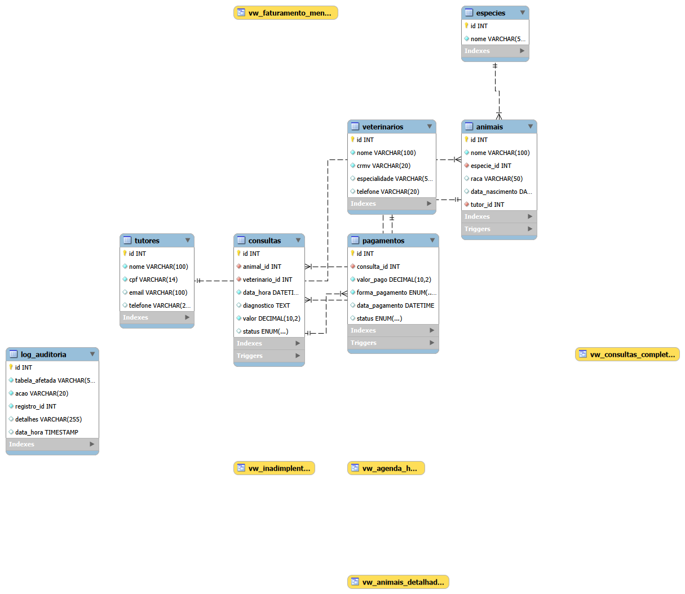

# 🐾 PetVida — API + Banco de Dados


Sistema de gestão para clínica veterinária desenvolvido como projeto final do curso SENAI. O projeto combina um banco de dados relacional MySQL com procedures, views, functions e triggers a uma API REST em Node.js + Express.

O banco gerencia **6 tabelas** (veterinarios, tutores, especies, animais, consultas, pagamentos) com lógica de negócio implementada em stored procedures (agendamento, conclusão, cancelamento, pagamento) e views para consultas complexas e relatórios gerenciais.

A API expõe **8 endpoints** que conectam o front-end ao banco, chamando as procedures e views já construídas — o trabalho pesado dos JOINs e validações fica no banco, deixando os endpoints enxutos.

## 📸 Diagrama Entidade-Relacionamento



## 🛠 Tecnologias

| Tecnologia | Versão | Uso |
|-----------|--------|-----|
| MySQL | 8.0 | Banco de dados relacional |
| Node.js | 24 | Runtime da API |
| Express | 4.21 | Framework web |
| mysql2 | 3.11 | Conexão assíncrona com MySQL |
| cors | 2.8 | Liberação de requisições cross-origin |
| dotenv | 16.4 | Variáveis de ambiente |
| nodemon | 3.1 | Auto-reload em desenvolvimento |

## 🗄 Estrutura do Banco

| Tipo | Quantidade | Detalhes |
|------|-----------|----------|
| Tabelas | 6 | veterinarios, tutores, especies, animais, consultas, pagamentos |
| Views | 5 | vw_consultas_completas, vw_agenda_hoje, vw_animais_detalhados, vw_faturamento_mensal, vw_inadimplentes |
| Procedures | 5 | sp_agendar_consulta, sp_concluir_consulta, sp_registrar_pagamento, sp_cancelar_consulta, sp_cadastrar_animal |
| Functions | 5 | fn_idade_animal, fn_total_gasto_tutor, fn_qtd_consultas_animal, fn_status_emoji, fn_classificar_valor |
| Triggers | 5 | INSERT/UPDATE/DELETE com log de auditoria |

## 📡 Endpoints da API

| Método | Rota | Descrição | Origem |
|--------|------|-----------|--------|
| GET | `/api/veterinarios` | Lista todos os veterinários | Tabela |
| GET | `/api/animais` | Lista animais com tutor e espécie | View |
| GET | `/api/agenda/:data` | Consultas de uma data específica | View |
| POST | `/api/consultas` | Agenda nova consulta | Procedure |
| PUT | `/api/consultas/:id/concluir` | Conclui consulta com diagnóstico | Procedure |
| POST | `/api/pagamentos/:consulta_id` | Registra pagamento | Procedure |
| GET | `/api/relatorios/dashboard` | Dashboard financeiro | Query agregada |
| GET | `/api/relatorios/inadimplentes` | Lista de inadimplentes | View |

## 🚀 Como Executar

### Pré-requisitos
- MySQL 8.0 ou MariaDB 10.4+
- Node.js 18+
- MySQL Workbench (opcional)

### 1. Clonar e instalar dependências
```bash
git clone https://github.com/niltonsSantana-devBa/petvida_v2.git
cd petvida_v2
npm install
```

### 2. Importar banco de dados
Execute no MySQL Workbench (ou terminal) na seguinte ordem:

```sql
-- 1. Estrutura das tabelas
source database/schema/01_tables.sql;

-- 2. Dados de teste
source database/schema/02_seed.sql;

-- 3. Views
source database/logic/01_views.sql;

-- 4. Procedures
source database/logic/02_procedures.sql;

-- 5. Functions
source database/logic/03_functions.sql;

-- 6. Triggers
source database/logic/04_triggers.sql;
```

### 3. Configurar conexão
Edite o arquivo `.env` com suas credenciais:

```env
DB_HOST=localhost
DB_USER=root
DB_PASSWORD=sua_senha
DB_NAME=petvida_v2
PORT=3001
```

### 4. Iniciar servidor
```bash
npm run dev
```

A API estará disponível em `http://localhost:3001`.

## 📁 Estrutura do Projeto

```
petvida_v2/
│
├── api/                          # API Node.js + Express
│   ├── server.js                 # Servidor principal
│   ├── config/
│   │   └── database.js           # Pool de conexão MySQL
│   └── routes/                   # Rotas da API
│       ├── veterinarios.js       # GET /api/veterinarios
│       ├── animais.js            # GET /api/animais
│       ├── consultas.js          # POST + PUT + GET agenda/:data
│       ├── pagamentos.js         # POST /api/pagamentos/:id
│       └── relatorios.js         # GET dashboard + inadimplentes
│
├── database/                     # Arquivos SQL
│   ├── schema/                   # Estrutura do banco
│   │   ├── 01_tables.sql         # CREATE DATABASE + TABELAS
│   │   ├── 02_seed.sql           # Dados de teste
│   │   └── 03_export_full.sql    # Dump completo
│   ├── logic/                    # Lógica do banco
│   │   ├── 01_views.sql          # 5 views
│   │   ├── 02_procedures.sql     # 5 procedures
│   │   ├── 03_functions.sql      # 5 functions
│   │   ├── 04_triggers.sql       # 5 triggers
│   │   └── 05_reports.sql        # 6 relatórios
│   ├── security/
│   │   └── 01_users.sql          # 4 perfis de usuário
│   └── backup/
│       ├── script.sh             # Script de backup
│       └── files/                # Backups salvos
│
├── docs/
│   └── der.png                   # Diagrama ER
│
├── .env                          # Credenciais (não versionado)
├── .gitignore
├── LICENSE
├── package.json
└── README.md
```

## 👨‍💻 Autor

**Nilton S. Santos**  
🔗 [GitHub](https://github.com/niltonsSantana-devBa)  
📧 niltonsantana.dev@gmail.com

Projeto final desenvolvido para o curso de Banco de Dados do **SENAI**.
